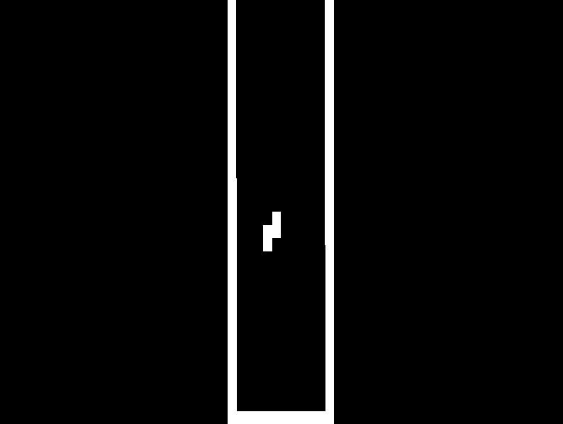

# CHIP-8 [Work in progress]
[The core logic](chip8/chip8.go) is almost done, the rest no so much.
Current progress   

### References/Credits:
[CHIP-8 wiki](https://github.com/mattmikolay/chip-8/wiki)   
[Guide to making a CHIP-8 emulator](https://tobiasvl.github.io/blog/write-a-chip-8-emulator/)   
[How to write an emulator](https://multigesture.net/articles/how-to-write-an-emulator-chip-8-interpreter)   
[Building a CHIP-8 emulator](https://austinmorlan.com/posts/chip8_emulator/)
